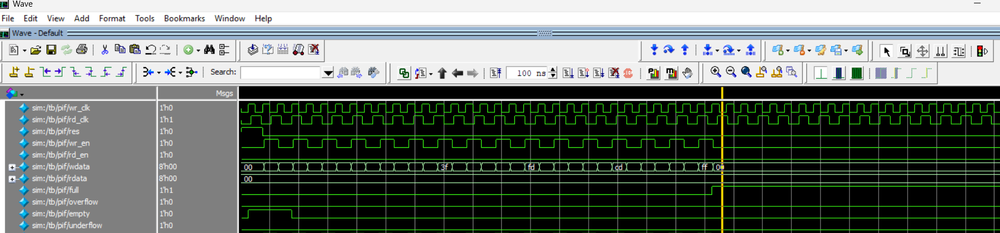
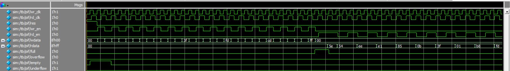
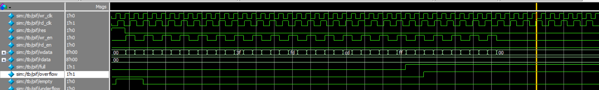
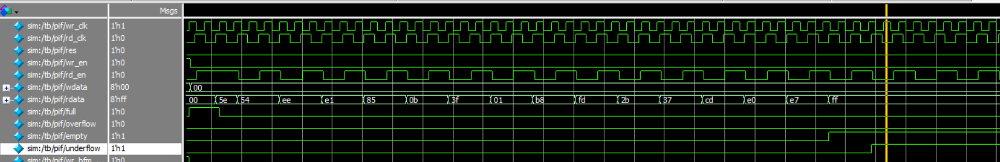
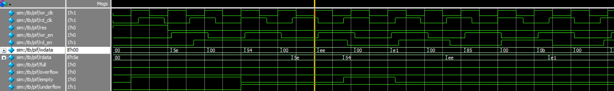

## Asynchronous FIFO Verification

## Project Overview

This project focuses on the design verification of an Asynchronous FIFO using SystemVerilog. The verification environment is developed to verify FIFO read/write functionality, boundary conditions, and data integrity across asynchronous clock domains.

## Technologies Used

* Verilog HDL
* SystemVerilog
* Questa/ModelSim
* Functional Coverage
* SystemVerilog Assertions

## Verification Environment

The testbench includes:

* Generator
* Driver/BFM
* Monitor
* Scoreboard
* Functional Coverage
* Assertions

## Key Verification Features

* Verified FIFO **read and write operations**
* Verified **data integrity** between write and read operations
* Verified **FULL** and **EMPTY** FIFO conditions
* Verified **overflow** and **underflow** conditions
* Verified operation across **independent read and write clock domains**
* Used **SystemVerilog testbench components** for functional verification
* Implemented **functional coverage** to measure verification completeness
* Used **Questa/ModelSim** for simulation and debugging

## Verification Environment

The Asynchronous FIFO verification environment is developed using SystemVerilog and consists of separate read and write verification components.

### Testbench Components

* **Generator** — Generates read and write transactions.
* **Driver/BFM** — Drives transactions to the FIFO interface.
* **Monitor** — Monitors FIFO read/write activity and collects transaction information.
* **Scoreboard** — Compares expected data with actual FIFO output data to verify data integrity.
* **Functional Coverage** — Measures coverage of important FIFO operations and conditions.
* **Assertions** — Checks FIFO behavior and protocol-related conditions during simulation.

### Read-Side Components

* `rd_gen.sv`
* `rd_bfm.sv`
* `rd_mon.sv`
* `rd_cov.sv`
* `rd_agent.sv`
* `rd_tx.sv`

### Write-Side Components

* `wr_gen.sv`
* `wr_bfm.sv`
* `wr_mon.sv`
* `wr_cov.sv`
* `wr_agent.sv`
* `wr_tx.sv`

### Common Components

* `fifo_env.sv`
* `fifo_sbd.sv`
* `fifo_intrf.sv`
* `fifo_common.sv`
* `fifo_top.sv`

## Test Cases

The following test cases were implemented and verified for the Asynchronous FIFO:

| Test Case       | Description                                                              |
| --------------- | ------------------------------------------------------------------------ |
| Reset Test      | Verifies FIFO behavior during and after reset.                           |
| Write Test      | Verifies writing data into the FIFO.                                     |
| Read Test       | Verifies reading data from the FIFO.                                     |
| Write-Read Test | Verifies data integrity between write and read operations.               |
| Full Test       | Verifies FIFO behavior when the FIFO reaches the full condition.         |
| Overflow Test   | Verifies FIFO behavior when a write is attempted while the FIFO is full. |
| Empty Test      | Verifies FIFO behavior when the FIFO reaches the empty condition.        |
| Underflow Test  | Verifies FIFO behavior when a read is attempted while the FIFO is empty. |

## Assertions and Functional Coverage

### Assertions

Procedural assertions are used to verify successful transaction randomization:

```systemverilog
assert(randomize());
```

The assertion ensures that the `randomize()` operation succeeds before the randomized transaction is used.

### Functional Coverage

Functional coverage is implemented to measure the verification of important FIFO scenarios and transaction behavior.

Coverage components are included for both the read and write sides of the verification environment.

## Project Structure

```text
Asynchronous-FIFO-Verification/
│
├── async_fifo.v              # Asynchronous FIFO RTL
│
├── fifo_top.sv               # Top-level testbench
├── fifo_env.sv               # Verification environment
├── fifo_intrf.sv             # FIFO interface
├── fifo_common.sv            # Common definitions
├── fifo_sbd.sv               # Scoreboard
├── list.svh                  # File/package list
│
├── wr_agent.sv               # Write agent
├── wr_bfm.sv                 # Write BFM
├── wr_gen.sv                 # Write generator
├── wr_mon.sv                 # Write monitor
├── wr_cov.sv                 # Write-side coverage
├── wr_tx.sv                  # Write transaction
│
├── rd_agent.sv               # Read agent
├── rd_bfm.sv                 # Read BFM
├── rd_gen.sv                 # Read generator
├── rd_mon.sv                 # Read monitor
├── rd_cov.sv                 # Read-side coverage
├── rd_tx.sv                  # Read transaction
│
├── run.do                    # Simulation script
├── cod_cov.do                # Coverage script
├── exclusion.do             # Coverage exclusion script
│
├── .gitignore                # Git ignored files
└── README.md                 # Project documentation
```

## Simulation and Verification Results

The Asynchronous FIFO was verified through simulation using the implemented SystemVerilog verification environment.

The following scenarios were verified:

* Reset operation
* FIFO write operation
* FIFO read operation
* Write and read data integrity
* FIFO full condition
* FIFO overflow condition
* FIFO empty condition
* FIFO underflow condition

### Simulation

The testbench was simulated using **Questa/ModelSim**. Simulation scripts are provided in the repository to simplify compilation and test execution.

### Coverage

Functional coverage was collected for the implemented read and write verification scenarios to evaluate verification completeness.

## Simulation Waveforms

### FIFO Full Condition

The waveform demonstrates the FIFO reaching the full condition during write operations.



### FIFO Empty Condition

The waveform demonstrates the FIFO reaching the empty condition during read operations.



### FIFO Overflow Condition

The waveform demonstrates an attempted write operation when the FIFO is already full.



### FIFO Underflow Condition

The waveform demonstrates an attempted read operation when the FIFO is already empty.



### Concurrent Read and Write

The waveform demonstrates concurrent read and write operations in the asynchronous FIFO.




